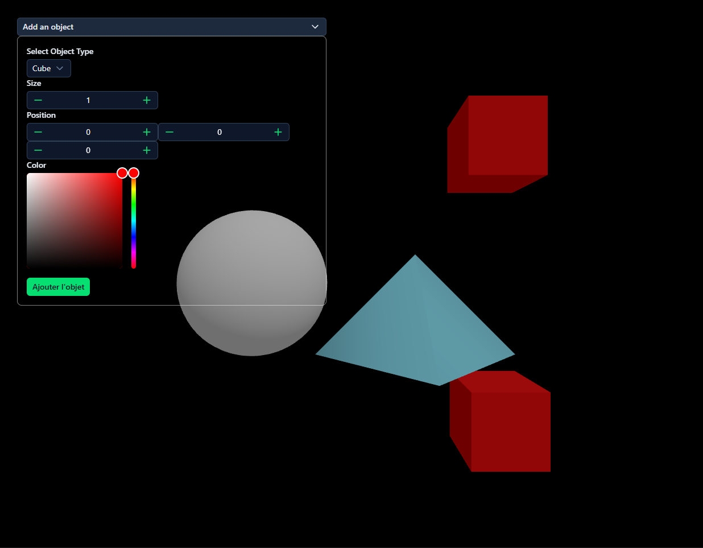

# Assignment Nuxt.JS / Flask



## Installation

### Install script

I've provided an install script to set up the project:

```bash
./install.sh
```

### Manual install

#### Frontend

1. Install [Node.js](https://nodejs.org/) (which includes npm).
2. Install project dependencies:

```bash
cd frontend
pnpm install # Or any other package manager you prefer (npm, yarn, etc...)
```

#### Backend

1. Install [Python 3](https://www.python.org/downloads/) and
   [pip](https://pip.pypa.io/en/stable/installation/).
2. Create a virtual environment and install dependencies:

```bash
cd backend
python3 -m venv venv
source venv/bin/activate
pip install -r requirements.txt
```

## Usage

### Docker

To run the application using Docker, you can use the provided
`docker-compose.yaml` file. Start the services:

```bash
docker-compose up --build
```

This command will build the images and start the containers for both the
frontend and backend services.

### Manually

Start the backend server:

```bash
cd backend
source venv/bin/activate
python app.py
```

Start the frontend development server:

```bash
cd frontend
pnpm dev
```

## Added dependencies

None
